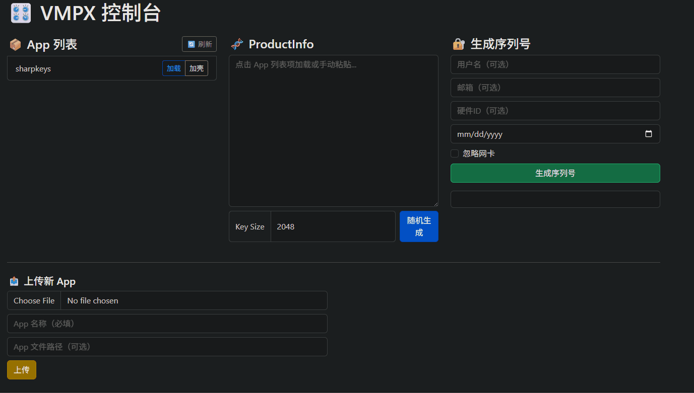

# <div align="center">🔒 VMPX - 基于 VMP 的加壳控制台 🔒</div>

简体中文

<p align="center">
<a></a>
<a></a>
<a></a>
</p>

---

`VMPX` 是一款基于 C++ 后端与现代前端技术构建的 Web 软件，用于通过 VMProtect（VMP）对应用程序进行加壳保护。  

---

### <div align="center">🚀 功能</div>

- **生成随机产品信息**：输入密钥长度，点击生成  
- **加载 App 产品信息**：点击列表中已有 App 加载信息  
- **生成序列号**：填写用户信息和过期时间，点击生成  
- **上传新 App**：选择文件并填写名称，上传新程序  
- **打包加壳**：选择 App，点击加壳打包按钮  

<br/>




---

## <div align="center">🚀 特性</div>

- **完整API接口**：支持产品信息随机生成、序列号生成、应用上传、加壳打包等  
- **用户友好前端**：基于 Alpine.js + Bootstrap，界面清晰操作便捷  
- **多字段序列号**：支持用户名、邮箱、硬件ID及过期时间自定义  
- **轻量部署**：纯 C++ 服务端，前端静态文件，适合多种部署环境  
- **开源协议**：采用 MIT 许可证，开放自由，便于集成和扩展  
- **平台支持**: 仅支持在windows/x64平台运行

---

## <div align="center">🛠 快速使用</div>

### 编译与启动

1. 克隆仓库并编译 C++ 后端服务  
2. 将前端静态页面（`index.html`）部署到任意 Web 服务器  
3. 启动后端服务并确保其对外开放 API 接口  
4. 使用浏览器访问前端页面，进行加壳操作

## <div align="center">🧩 API 简要</div>

| 接口                         | 方法 | 说明                 |
|------------------------------|------|----------------------|
| `/api/v1/gen_random_product_info` | POST | 生成随机 ProductInfo |
| `/api/v1/gen_serial_number`        | POST | 根据产品信息生成序列号 |
| `/api/v1/app/list`                 | GET  | 获取 App 列表        |
| `/api/v1/app/add`                  | POST | 上传新 App           |
| `/api/v1/app/pack`                 | POST | 对指定 App 进行加壳打包 |
| `/api/v1/app/product_info`         | GET  | 获取指定 App 产品信息 |

详细接口定义请查看项目 OpenAPI 规范。

---

## <div align="center">💻 开发指南</div>

### 前端技术栈

- [Alpine.js](https://alpinejs.dev/)：轻量级响应式数据绑定  
- [Bootstrap 5](https://getbootstrap.com/)：响应式 UI 框架  

### 后端技术栈

- C++17/20 编写，提供高性能 HTTP API，方便二次开发和集成
- `libhv`、`log4cplus`、`Crypto++`、`boost`等10+第三方库，详细请参考`app/source/third/xmake.lua`

### 克隆 & 编译运行示例

```powershell
# 安装xmake
git clone https://github.com/lona-cn/vmpx.git
cd vmpx
./scripts/build-windows_x64_msvc.bat
# xmake run vmpx_server [ip] [port] [VMProtect_Con.exe文件路径]
xmake run vmpx_server 0.0.0.0 11451 VMProtect_Con.exe
```

注意：
  - 如果不指定`VMProtect_Con.exe文件路径`则不能使用加壳功能
  - `VMProtect_Con.exe`并不包含在本项目中，请自行购买VMProtect授权的软件
  - 添加新的软件，需要在`zip`内包含`.exe`文件和`.vmp`文件，请参考`doc/zip/sharpkeys.zip`

## 联系方式
QQ群：364057904