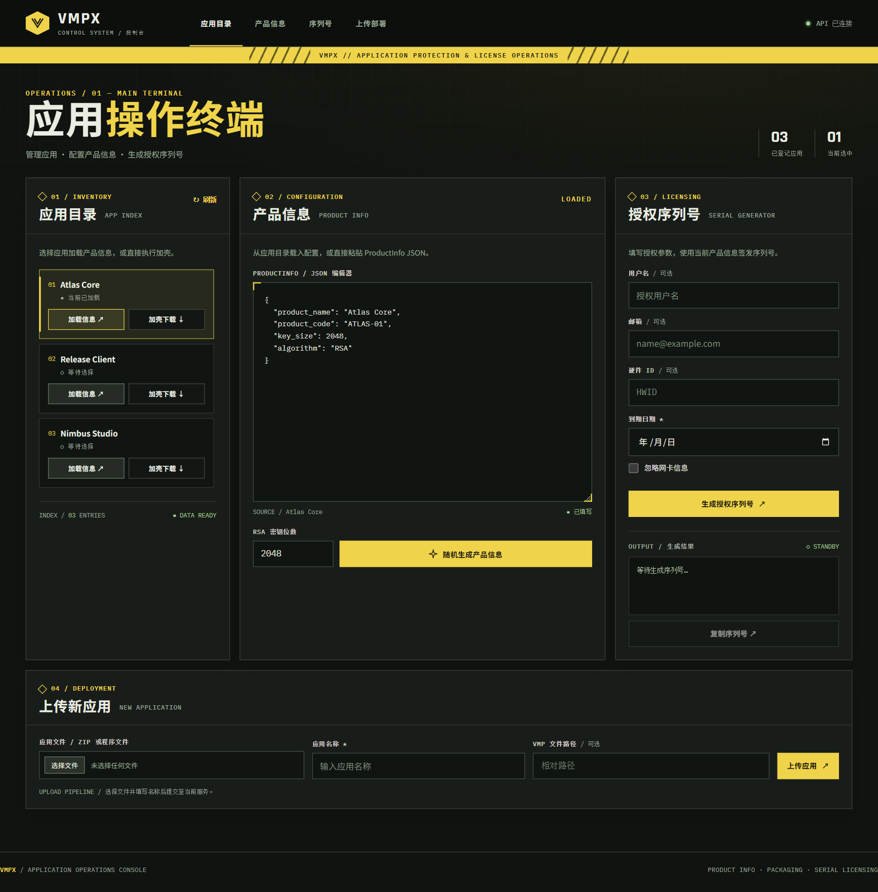

# <div align="center">🔒 VMPX - 基于 VMP 的加壳控制台 🔒</div>

简体中文

<p align="center">
<a></a>
<a></a>
<a></a>
</p>

---

`VMPX` 是一款基于 C++ 后端与现代前端技术构建的 Web 软件，用于通过 VMProtect（VMP）对应用程序进行加壳保护。  

---

## 控制台



*界面示意图使用示例应用与产品信息；实际列表和状态由当前服务返回。*

控制台分为四个工作区：

1. **应用目录**：查看已登记应用，点击「加载信息」填入产品信息，或点击「加壳下载」获取打包结果。
2. **产品信息**：编辑或粘贴 ProductInfo JSON，也可以设置 RSA 密钥位数并随机生成。
3. **授权与每日激活**：填写授权参数生成序列号，或签发有效期内的激活码，供客户端按 UTC 日期每日换取序列号。
4. **上传部署**：选择应用文件、填写应用名称和可选的 VMP 文件路径后上传。

桌面端以多栏呈现，窄屏设备按工作区纵向排列；顶部显示 API 连接状态。

---

## <div align="center">🚀 特性</div>

- **完整API接口**：支持产品信息随机生成、序列号生成、每日激活码、应用上传和加壳打包
- **响应式控制台**：深色面板、状态反馈与移动端布局；由 Alpine.js 驱动，无需前端构建步骤
- **轻量部署**：纯 C++ 服务端，前端静态文件；提供 Linux x86_64 + Wine + noVNC Docker 部署
- **开源协议**：采用 MIT 许可证，开放自由，便于集成和扩展
- **平台支持**：原生构建目标为 Windows x64；Linux 通过 Docker/Wine 运行 Windows 发布包

---

## <div align="center">🛠 快速使用</div>

### 编译与启动

1. 克隆仓库并编译 C++ 后端服务。
2. 启动服务，在浏览器打开其地址（下方示例为 `http://localhost:11451/`）。服务会提供控制台静态页面及 `/api/v1/` 接口。
3. 在「上传部署」登记应用，然后从「应用目录」加载信息或加壳下载；生成序列号前需准备 ProductInfo JSON 和到期日期。

### 自动构建与发布

提交到默认分支 `master` 后，GitHub Actions 会构建 Windows x64 版本、构建并运行 `VMProtectSDK64` demo 的未加壳冒烟检查，并运行 C++ 回归测试；全部通过后创建 `snapshot-<完整提交 SHA>` 预发布版本。推送 `v*` 版本 tag 会构建 Windows x64 版本并以该 tag 创建 GitHub Release；`v1.2.3-rc.1` 等带连字符的 tag 会发布为预发布版本。面向 `master` 的 Pull Request 执行构建和测试，不发布 Release。每次构建的压缩包也可以从对应的 Actions 运行记录下载。

CI 使用 GitHub Secret `VMPROTECT_CON_PASSPHRASE` 解密 `app/binaries/VMProtect_Con.zip`；master push 和版本 tag 构建需要该 Secret，PR 工作流无法访问该 Secret 时会跳过解密。明文仅在构建和测试期间存在，并在打包前删除，不会包含在 Actions artifact 或 Release 中。

在 [Releases](https://github.com/lona-cn/vmpx/releases) 下载压缩包并解压；服务程序、依赖文件、配置和 Web 页面需保持原有目录结构。请在解压后的目录启动程序。压缩包不包含 `VMProtect_Con.exe`，使用加壳功能时需自行提供合法授权的可执行文件路径。

### Linux x86_64：Docker + Wine + noVNC

Linux 容器运行已发布的 Windows x64 程序，不是原生 Linux 构建。VMProtect 不包含在仓库或发布包内；需单独提供有合法授权的 `VMProtect_Con.exe`。推送 `v*` 版本 tag 会自动构建 Windows 发布包并创建 GitHub Release，同时构建并发布 `ghcr.io/lona-cn/vmpx:<tag>`；非预发布 tag 也会更新镜像 `latest`。首次推送后需在 GitHub Packages 将镜像包可见性设为 Public，公开拉取才无需认证。

```sh
docker pull ghcr.io/lona-cn/vmpx:latest

# 准备发布目录和 noVNC 密码文件。x11vnc 使用传统 VNC 认证，只采用密码前 8 个字符。
sudo chown -R 10001:10001 /srv/vmpx/release
umask 077
openssl rand -hex 4 > /srv/vmpx/vnc_password
sudo chown 10001:10001 /srv/vmpx/vnc_password

docker run --rm \
  -v /srv/vmpx/release:/opt/vmpx \
  -v /srv/vmpx/vnc_password:/run/secrets/vnc_password:ro \
  -p 127.0.0.1:11451:11451 \
  -p 127.0.0.1:6080:6080 \
  -e VMProtect_CON=/opt/vmpx/VMProtect_Con.exe \
  -e VMPX_ENABLE_NOVNC=1 \
  ghcr.io/lona-cn/vmpx:latest
```

将 Windows x64 发布压缩包解压到 `/srv/vmpx/release`；若不挂载 `VMProtect_Con.exe`，服务仍可运行但不能加壳。容器以 UID/GID `10001` 运行，发布目录和密码文件必须允许该用户读取，`/opt/vmpx/data` 必须可写。noVNC 默认关闭；启用时必须提供只读挂载的密码文件。VNC 密码认证最多使用前 8 个字符，因此示例限制为 8 个随机十六进制字符，并将 6080 绑定到宿主机回环地址；不要将该端口公开到不可信网络。

## <div align="center">🧩 API 简要</div>

| 接口                                  | 方法 | 说明                              |
|---------------------------------------|------|-----------------------------------|
| `/api/v1/gen_random_product_info`     | POST | 生成随机 ProductInfo              |
| `/api/v1/gen_serial_number`           | POST | 根据产品信息生成序列号            |
| `/api/v1/app/activation_codes`        | POST | 管理端创建每日激活码              |
| `/api/v1/app/activation_codes/revoke` | POST | 管理端撤销激活码              |
| `/api/v1/app/activate`                | POST | 客户端提交激活码和 HWID，换取当日序列号 |
| `/api/v1/app/list`                    | GET  | 获取 App 列表                     |
| `/api/v1/app/add`                     | POST | 上传新 App                        |
| `/api/v1/app/pack`                    | POST | 对指定 App 进行加壳打包           |
| `/api/v1/app/product_info`            | GET  | 获取指定 App 产品信息             |

详细接口定义请查看项目 OpenAPI 规范。

`/api/v1/app/add` 接受最大 256 MiB 的压缩包，最多 10,000 个条目、单文件解压后最多 512 MiB、总解压量最多 1 GiB。libhv 在调用应用处理器前会缓冲 HTTP 请求体，因此反向代理还必须设置不超过 256 MiB 的请求体上限。`/api/v1/app/pack` 的 VMProtect 子进程最多运行 10 分钟，捕获的标准输出限制为 1 MiB。

`POST /api/v1/app/activation_codes` 与 `/api/v1/app/activation_codes/revoke` 是管理端操作；激活码原文只在创建时返回，服务端以 SHA-256 摘要索引记录。启动时和创建新激活码前会清理过期记录。`data/activation_codes.yml` 会持久化对应 ProductInfo（包含私钥）、用户信息和授权到期日，必须限制数据目录的操作系统权限并纳入安全备份。服务本身没有 API 身份认证；反向代理应保护控制台及所有管理接口，只向客户开放 `/api/v1/app/activate`，并使用 HTTPS。

客户端每天按 UTC 日期提交 `{ "activation_code": "...", "hwid": "<VMProtect HWID 的 Base64>" }`，收到当日序列号后调用 `VMProtectSetSerialNumber`。此仓库没有客户端程序源码；SDK 调用需集成在使用者自己的受保护应用中。

---

## <div align="center">💻 开发指南</div>

### 前端技术栈

- [Alpine.js](https://alpinejs.dev/)：控制台的响应式状态与交互
- 原生 CSS：深色战术面板与响应式布局；运行时从 CDN 加载 Alpine.js 和字体

### 后端技术栈

- C++17/20 编写，提供高性能 HTTP API，方便二次开发和集成
- `libhv`、`log4cplus`、`Crypto++`、`boost`等10+第三方库，详细请参考`app/source/third/xmake.lua`

### 克隆 & 编译运行示例

```powershell
# 安装xmake
git clone https://github.com/lona-cn/vmpx.git
cd vmpx
./scripts/build-windows_x64_msvc.bat
# 构建并运行 VMProtectSDK64 x64 demo（未加壳时应报告 false）。
xmake build vmprotect_sdk_demo
xmake run vmprotect_sdk_demo --expect-unprotected

# xmake run vmpx_server [ip] [port] [VMProtect_Con.exe文件路径]
xmake run vmpx_server 0.0.0.0 11451 VMProtect_Con.exe
```

注意：
  - 如果不指定`VMProtect_Con.exe文件路径`则不能使用加壳功能
  - `VMProtect_Con.exe`并不包含在本项目中，请自行购买VMProtect授权的软件
  - 添加新的软件，需要在`zip`内包含`.exe`文件和`.vmp`文件，请参考`doc/zip/sharpkeys.zip`

## 联系方式
QQ群：364057904